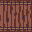
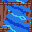
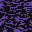
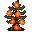
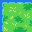
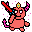
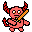
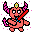
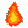

# Project 4 Additions by Peter Vu

# 56 New Images:
## 47 Unique, 9 Free Use

In images folder lies another folder called "handmade" which contains all of the new 32x32 assets I've created through
Photoshop drawing + image manipulation of old assets. Samples below:

 

# New Entities

## Portal 
- Mouse click to spawn portal
- Has Behaviors and Animations
- If spawned on grass, it burns it after a few seconds
- Spawns a fire entity
- Spawns a Demon entity at the end of its lifespan

## Demon  
- Has Behaviors and Animations 
- Hunts Fairies, paths toward them
- Spreads lava entities upon movement
- Spreads fire entities upon movement
- When it kills a fairy, it collects its soul (soulsCollected += 1), 
and transforms into an Ascended Demon with faster move speed and 
can spread more lava + fire

## Lava 
- Has Behaviors and Animations
- Burns background tiles below
- Spreads more lava entities
- Spreads more fire entities
- When close to water, turns both entities into Obsidian (background)

## Fire 
- Has Behaviors and Animations
- Burns background tiles below
- Spreads more fire entities

# Stuff I didn't add yet

# Music

WWE Kane entrance would play when you activate the world-changing event.

# Church and Priest Entity